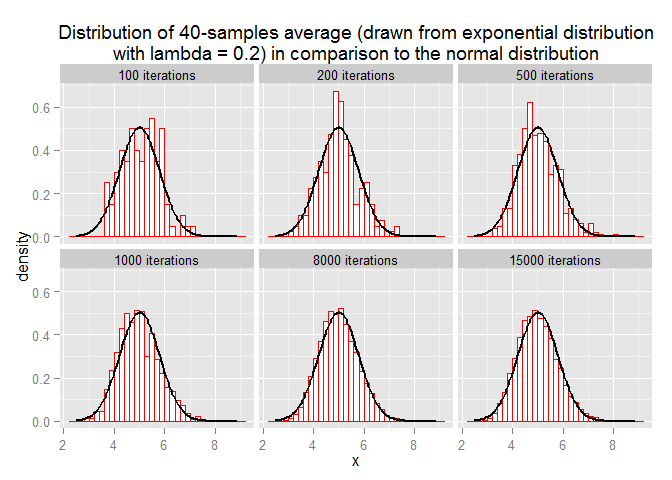
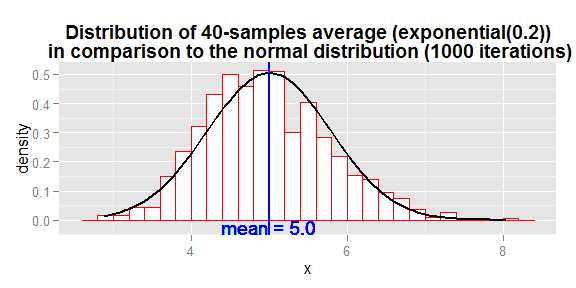
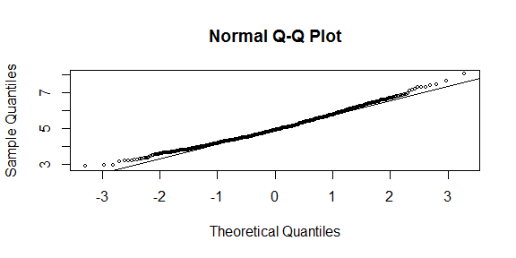
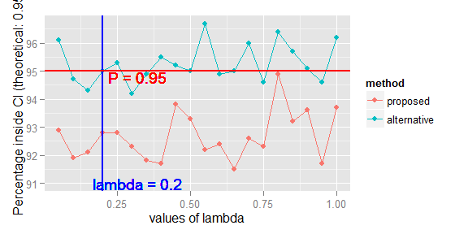
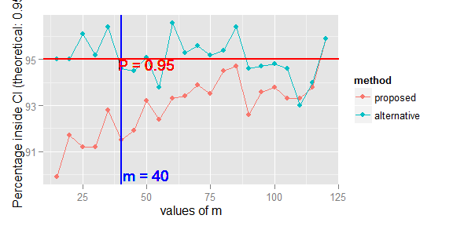

# Statistical Inference Course Project Part 1


The purpose of this part of the Course Project is to investigate the statistical behaviour of data following the exponential distribution. The properties of the distribution of the mean of 40 exponential(0.2)s will be illustrated via simulation and associated explanatory test.

In the code below simulation is performed with the use of the *rexp* function. The variables **n**  and **m** define the number of simulated random variables. The value of **n** must be large enough to produce stable results and a range of values (100, 200, 500, 1000, 8000, 15000) is used for simulation, in order to be able to illustrate the convergence of the distribution for large numbers ( >= 1000). The value of **m** is 40 as the investigation is concentrated on the distribution of averages of 40 exponential(0.2)s. 


```r
n <- c(100, 200, 500, 1000, 8000, 15000)
m <- 40
lambda <- 0.2

results <- lapply(n, function(x) {
     apply(matrix(rexp(x*m, rate = lambda), x, m), 1, mean)
})
```

##1. Show where the distribution is centered at and compare it to the theoretical center of the distribution.

The center of the distribution of the simulated data can be calculated with the mean function. The results for the three maximum values of *n* (1000, 8000, 15000) are:


```r
sapply(results[4:6], mean)
```

```
## [1] 4.972 5.001 4.989
```

The theoritical center of the distribution is `1/lambda = 1/0.2 = 5` which is the mean of the exponential distribution with rate equals to *lambda*. The calculated values through simulation are very close to the theoretical value.

##2. Show how variable it is and compare it to the theoretical variance of the distribution.

The variability of the distribution can be illustrated with the sample variance:


```r
sapply(results[4:6], var)
```

```
## [1] 0.6438 0.6076 0.6338
```

According to the simulation parameters the theoretical variance of the 40 exponential(0.2)s average is equal to the variance (second power of standard deviation) of the exponential(0.2) distribution divided by the number of samples used for averaging: `1/lambda^2/40 = 0.625'. The calculated values through simulation are very close to the theoretical value.

##3. Show that the distribution is approximately normal.

Simulation for small iterations was also performed to be able to visualize the convergence of the 40-average distribution shape, for large number of iterations (a thousand or so), to the normal distribution. The normal distribution with mean and standard deviation in accordance with the theoretical values, presented in the previous questions, is plotted. It is obvious that for 1000 iterations the distribution is already very close to the normal distribution.

 

 

Another visualization technique for normality test is the QQ plot. This graph is presented only for the case of 1000 iterations but the conclusions can be generalized for more iterations (8000, 15000).


```r
qqnorm(results[[4]], cex = 0.5); qqline(results[[4]])
```

 

The qqplot is very close to the theoretical line, therefore normality is strong, especially in the central region. Departure from normality is observed in the tails of the distribution.

##4. Evaluate the coverage of the confidence interval for 1/lambda.

The proposed formula $\bar{X}\pm 1.96\frac{s}{\sqrt{n}}$ (method = "proposed") for the confidence interval (95%) can be used to calculate the lower and upper limits of the interval, where the sample mean and standard deviation are used. For each iteration, it is tested if the population parameter 1/lambda is included in the interval. The percentage of successes is calculated. The interval is tested for a large number of iterations (1000) with samples of length 40.

Values of parameter lambda: 0.05 to 1.0 with step 0.05

In addition, an alternative way to define the limits of the confidence interval is also tested $\frac{1}{\bar{X}}\left ( 1\pm \frac{1.96}{\sqrt{n}} \right )$ (method = "alternative") and the results are closer to the theoretical 95% interval. Details about the approximation can be found in:

[wikipedia/Exponential_distribution#Confidence_intervals](http://en.wikipedia.org/wiki/Exponential_distribution#Confidence_intervals).


```r
nosim <- 1000

lamvals <- seq(0.05, 1, by = 0.05)

resl <- sapply(lamvals, function(lam) {

     simdata <- matrix(rexp(nosim*m, rate = lam), nosim, m)
     ml <- apply(simdata, 1, mean)
     sdl <- apply(simdata, 1, sd)
     
     ll <- ml - 1.96*sdl/sqrt(m)
     ul <- ml + 1.96*sdl/sqrt(m)

     ll2 <- 1/ml*(1 - 1.96/sqrt(m))
     ul2 <- 1/ml*(1 + 1.96/sqrt(m))
     
     c(mean((ll < 1/lam) & (ul > 1/lam))*100,
       mean((ll2 < lam) & (ul2 > lam))*100)
})
```

 

```
## [1] 92.8 95.0
```
To further investigate the coverage of the confidence interval the same analysis is performed for using different number of samples for average (from 15 to 120 with step 5). The code is not presented but is similar to the previous analysis while the incremental variable is not lambda but m.

 


```r
resm[,mvals == 40] # Values for our case (m = 40)
```

```
## [1] 91.5 94.6
```
