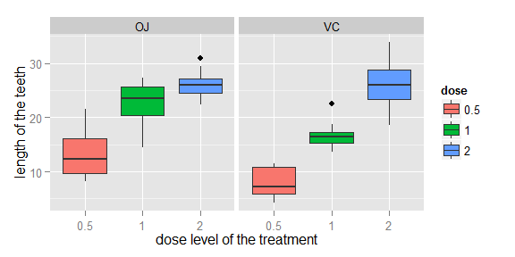

# Statistical Inference Course Project Part 2

The purpose of this part of the project is to analyze the ToothGrowth data in the R datasets package.

### Basic information about the dataset:

The response is the length of odontoblasts (teeth) in each of 10 guinea pigs at each of three dose levels of Vitamin C (0.5, 1, and 2 mg) with each of two delivery methods (orange juice or ascorbic acid).

### Format:

A data frame with 60 observations on 3 variables.

[,1]  **len** / numeric / Tooth length

[,2]	 **supp** / factor / Supplement type (VC or OJ).

[,3]	 **dose** / numeric / Dose in milligrams.


# 1. Load the ToothGrowth data and perform some basic exploratory data analyses 

These are the first rows of the dataset:


```
##    len supp dose
## 1  4.2   VC  0.5
## 2 11.5   VC  0.5
## 3  7.3   VC  0.5
## 4  5.8   VC  0.5
## 5  6.4   VC  0.5
## 6 10.0   VC  0.5
```

The first column - **len** - is the length of the teeth, the second - **supp** - is the delivery method (VC : vitamin C, OJ: orange juice) and the third - **dose** - is the dose level of the treatment (values: 0.5 or  1.0 or 2.0).  

The main interest is the dependence of length from dose and supp. In order to make some first remarks, a boxplot graph is plotted that tries to illustrate the depedence of **len** from **dose** for the two different **supp** values.

From the following boxplot some initial remarks can be made:

1. The length is an increasing function of dose for both delivery methods (separately or jointly)
2. The length for the case of *orange juice* seems in average better than the case of *vitamin C*.
3. For the two lowest dose levels (0.5 and 1.0), the length seems smaller for both delivery methods but for the maximum dose level (2.0) the mean length seems almost equal for both delivery methods

 

# 2. Provide a basic summary of the data.

The summary of the whole dataset shows the range of values of **len** and the values of the other two variables:


```
##       len       supp     dose   
##  Min.   : 4.2   OJ:30   0.5:20  
##  1st Qu.:13.1   VC:30   1  :20  
##  Median :19.2           2  :20  
##  Mean   :18.8                   
##  3rd Qu.:25.3                   
##  Max.   :33.9
```

The length variable **len** has values from 4.20 to 33.90. The **dose** takes three values of 0.5, 1.0 and 1.5 and each one appears for 20 times. Finally, the supplement type - **type** - takes two values (OJ and VC) and each one appears for 30 times. It is concluded that there is a total number of measurements of 60 and 10 for each combination of supplement and dose.

Further summary of **len** can be presented for the 6 combinations corresponding to each pair of **supp** and **dose**:

```
##   Group.1 Group.2 x.Min. x.1st Qu. x.Median x.Mean x.3rd Qu. x.Max.
## 1      OJ     0.5   8.20      9.70    12.20  13.20     16.20  21.50
## 2      VC     0.5   4.20      5.95     7.15   7.98     10.90  11.50
## 3      OJ       1  14.50     20.30    23.50  22.70     25.60  27.30
## 4      VC       1  13.60     15.30    16.50  16.80     17.30  22.50
## 5      OJ       2  22.40     24.60    26.00  26.10     27.10  30.90
## 6      VC       2  18.50     23.40    26.00  26.10     28.80  33.90
```

The numerical results are in agreement with the presented boxplot. 

# 3. Use confidence intervals and hypothesis tests to compare tooth growth by supp and dose. (Use the techniques from class even if there's other approaches worth considering)

We try to investigate the three visual observations during the exploratory data analysis, presented in section 1.

1. In order to test the increase of length as a function of dose level, for both supplement cases, four test hypotheses are formulated and the calculated limits of the interval and p-values are presented:


```
##   conf.int1 conf.int2
## 1   -13.416   -5.5244
## 2    -6.531   -0.1886
## 3   -11.266   -6.3143
## 4   -13.054   -5.6857
```

```
## [1] 8.785e-05 3.920e-02 6.811e-07 9.156e-05
```

From the calculated values and assuming an alpha level of 0.05, all the null hypothesis are rejected. From the confidence intervals it can be concluded that zero is not in interval and is purely negative. All these enforces that the function is increasing.

With the a simpler calculation can also illustrated that the previous fact is also valid when the two supplements are jointly calculated:


```
##   conf.int1 conf.int2
## 1   -11.984    -6.276
## 2    -8.996    -3.734
```

```
## [1] 1.268e-07 1.906e-05
```

2. A hypothesis test is formed to check if there is difference between *orange juice* and *vitamin C* while all the dose levels are included:


```
## conf.int1 conf.int2 
##    -0.171     7.571
```

```
## p.value 
## 0.06063
```

From the result of the analysis and the assumption of 0.05 alpha level, the null hypothesis cannot be rejected.

3. Hypothesis testing is used to compare the measurements for the same dose but with different delivery method. Three test hypotheses are formulated and the calculated limits of the interval and p-values are presented:


```
##   conf.int1 conf.int2
## 1    -8.781    -1.719
## 2    -9.058    -2.802
## 3    -3.638     3.798
```

```
## [1] 0.006359 0.001038 0.963852
```

For the two first tests (dose 0.5 and 1.0) the null hypothesis is rejected and the pure negative confidence interval does not include zero. But in the third case the case is exactly the opposite, the null hypothesis cannot be rejected. 

# 4. State your conclusions and the assumptions needed for your conclusions. 

The basic conclusions are:

1. The length increases as the dose level increase for both delivery methods, considered either separately or jointly.
2. When the doses are jointly analysed to compare the delivery methods, it cannot be concluded that one of the method is superior.
3. The *orange juice* delivery method is superior for low dose levels (0.5 and 1.0) but this cannot be supported for the maximum dose level (2.0).

The t.test (t-distribution) is used, so the assumption is made that the measurements follow the normal distribution. The results of the tests seem rather stable despite the small number of samples.
